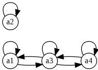
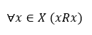
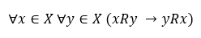
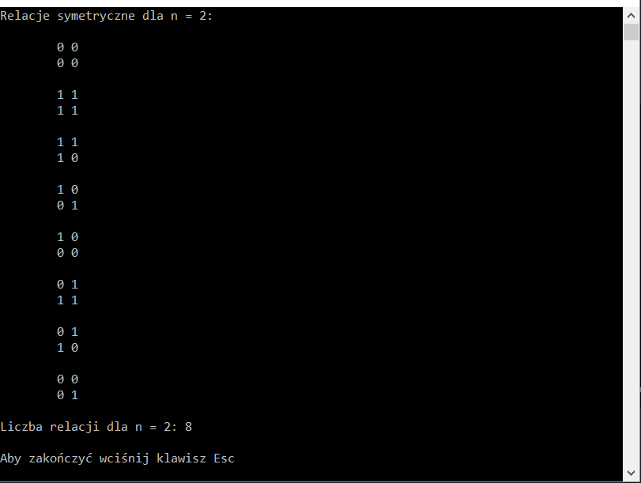
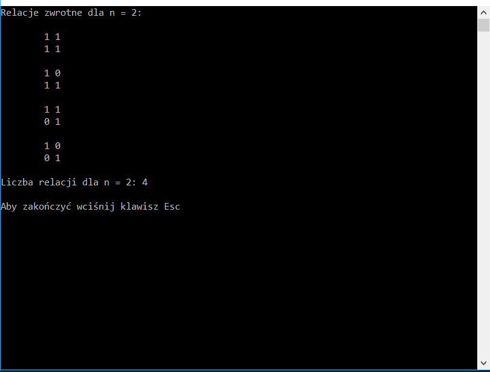
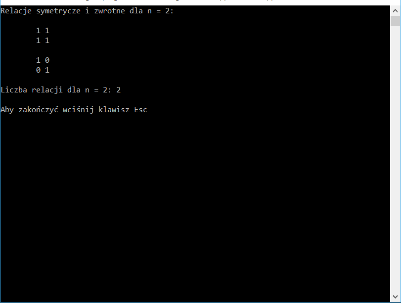

## Projekt z przedmiotu Wstęp do Logiki i Teorii Mnogości
### Program definiujący relacje zwrotne i symetryczne dla podanego n (max 5)
#### 0. Założenia początkowe
**Reprezentacja relacji**

Relacje binarne dla zbioru elementów o rozmiarze n są w programie reprezentowane za pomocą macierzy binarnej M o wymiarach n x n, gdzie każda kolumna oraz wiersz odpowiadają kolejno elementom a~1~, a~2~, ..., a~n~ ze zbioru, natomiast pola macierzy M[i,j] (gdzie i, j = 0,...,n-1) określają czy między uporządkowaną parą <a~i+1~,a~j+1~> zachodzi związek.

###### Przykład zapisu relacji

Przykładowa relacja zwrotna i symetryczna dla n = 4:

Reprezentacja relacji w programie:

| xRy  | a1 | a2 | a3 | a4 | 
| --- | --- | --- | --- | --- |
| a1  | 1  | 0  | 1  | 0  |
| a2  | 0  | 1  | 0  | 0  |
| a3  | 1  | 0  | 1  | 1  |
| a4  | 0  | 0  | 1  | 1  |

Pary uporządkowane:
<a1,a1>
<a2,a2>
<a3,a3>
<a4,a4>
<a3,a1>
<a1,a3>
<a4,a3>
<a3,a4>

**Własności relacji - zwrotność**

Jako relację zwrotną określamy taką relację, gdzie:

**Własności relacji - symetryczność**

Jako relację symetryczną określamy taką relację, gdzie:

#### 1. Działanie

Program ma do wyboru 3 opcje: 
- zdefiniowanie relacji symetrycznych, 
- zdefiniowanie relacji zwrotnych,
- zdefiniowanie relacji symetrycznych i zwrotnych.

**Algorytm**

1. Dla zadanego n tworzona jest macierz n x n wypełniona zerami, która jest przekazywana jako argument do głównej funkcji rekurencyjnej tworzącej wszystkie możliwe kombinacje zer i jedynek w tej macierzy.

2. Funkcja rekurencyjna przyjmuje cztery argumenty: _macierz, n, indeks_wiersza, indeks_kolumny_. Przy pierwszym wywołaniu indeksy to [0,0]. Funkcja przetwarza macierz kolumnami w następujący sposób:

    2.1. Przy każdym wywołaniu sprawdzany jest warunek, czy indeks kolumny przekazany jako argument nie wykracza poza rozmiar macierzy, czyli czy nie przetworzono całej macierzy. Jeśli tak, funkcja zostaje przerwana.
    
    2.2. Następnie sprawdzany jest warunek dla wiersza. Jeśli przekracza on rozmiar macierzy, oznacza to, że cała kolumna została przetworzona i funkcja wywoływana jest dla kolejnej kolumny, czyli _indeksu_wiersza_ = 0 i _indeksu_kolumny_ + 1.
    
    2.3. Jeśli powyższe warunki nie są spełnione, pole macierzy dla aktualnych indeksów zostaje ustawione na 1: _M[indeks_wiersza,indeks_kolumny]_ = 1 i funkcja wywołana zostaje dla kolejnej pozycji w kolumnie, czyli _indeksu_wiersza_ + 1 i _indeksu_kolumny_.
    
    2.4. W kolejnym kroku, w zależności od wybranej opcji, sprawdzane jest czy akualna macierz spełnia warunki dla relacji symetrycznej, zwrotnej lub obu **(patrz punkt 3)**.
    
    2.5. Następnie pole macierzy dla aktualnych indeksów zostaje ponownie ustawione na 0: _M[indeks_wiersza,indeks_kolumny]_ = 0 i funkcja zostaje wywołana dla kolejnej pozycji w kolumnie, czyli  _indeksu_wiersza_ + 1 i _indeksu_kolumny_.
    
3. Sprawdzanie czy macierz spełnia zadany warunek:
    
     3.1. Symetryczności - przechodząc kolumny, dla każdego pola gdzie indeks_wiersza jest różny od indeksu_kolumny sprawdzane jest, czy wartości pól M[indeks_wiersza,indeks_kolumny] i M[indeks_kolumny,indeks_wiersza] są takie same. Jeśli nie, oznacza to, że relacja nie jest symetryczna.
        
     3.2. Zwrotności - przechodząc kolumny, dla każdego pola gdzie indeks_wiersza i indek_kolumny jest równy sprawdzane jest, czy wartość pola M[indeks_wiersza,indeks_kolumny] jest równa 1. Jeśli nie, oznacza to, że relacja nie jest zwrotna.
        
     3.3. Symetryczności i zwrotności - sprawdzane są oba powyższe warunki.
        
     3.4. Jeśli każde pole w macierzy spełnia zadany warunek macierz jest wypisywana jako wynik.
     
##### Przykład działania programu dla n = 2:

